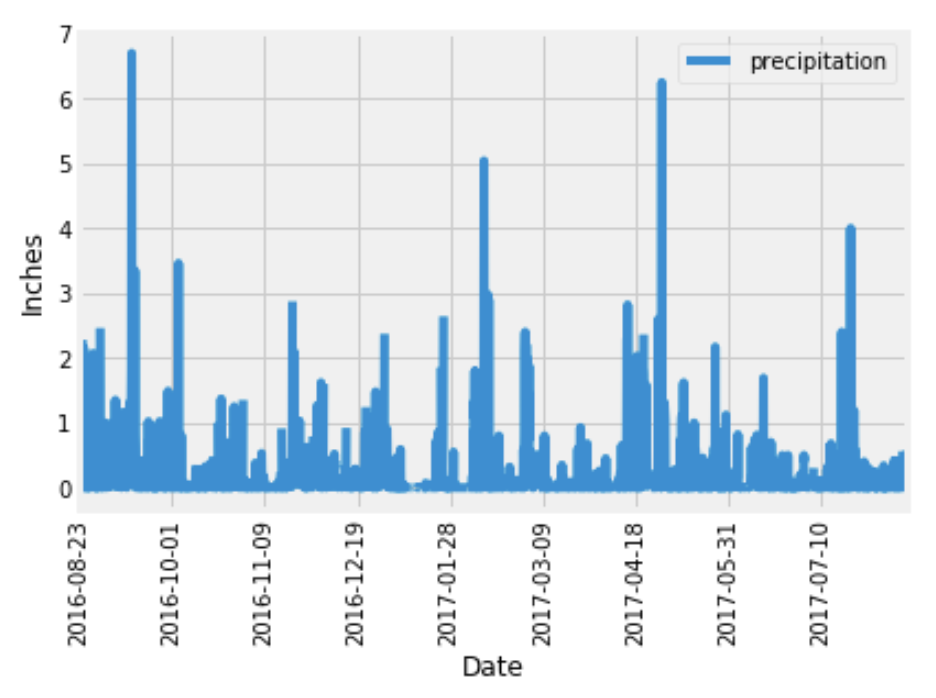

# Surfs Up!-SQLAlchemy

### Summary

With the use of Python and SQLAlchemy, i did basic climate analysis and data exploration of hawaii climate database with 19551 rows of data. All of the analysis is completed using SQLAlchemy ORM queries, Pandas, and Matplotlib.

### Precipitation Analysis

I retrieved the last 12 months of precipitation data, plot the results and print the summary statistics.

  

### Station Analysis

I fount the most active stations and retrieved the last 12 months of temperature observation data (TOBS).

  
  

### Climate App
I designed a Flask API based on the queries that I have just developed.

### Routes

* `/`

  Home page which list all routes that are available.

* `/api/v1.0/precipitation`

   Return the JSON representation of data and precipitation

* `/api/v1.0/stations`

   Return a JSON list of stations from the dataset.

* `/api/v1.0/tobs`
 
  Return a JSON list of temperature observations (TOBS) for the most active station for the previous year.

* `/api/v1.0/<start>` and `/api/v1.0/<start>/<end>`

  * Return a JSON list of the minimum temperature, the average temperature, and the max temperature for a given start or start-end range.

### Temperature Analysis I

Question: Hawaii is reputed to enjoy mild weather all year. Is there a meaningful difference between the temperature in, for example, June and December?

I Identified the average temperature in June and December at all stations across all available years in the dataset and did the same for December temperature.

Then i used unpaired t-test to determine whether the difference in the means, if any, is statistically significant. 

### Temperature Analysis II

Calculate the min, avg, and max temperatures for any range of dates.

   

### Daily Rainfall Average

Calculate the total amount of rainfall per weather station for a range of dates

### Daily Temperature Normals

Calculate the daily Normals( the averages for the min, avg, and max temperatures) for a range of dates

* Use Pandas to plot an area plot (`stacked=False`) for the daily normals.

  

